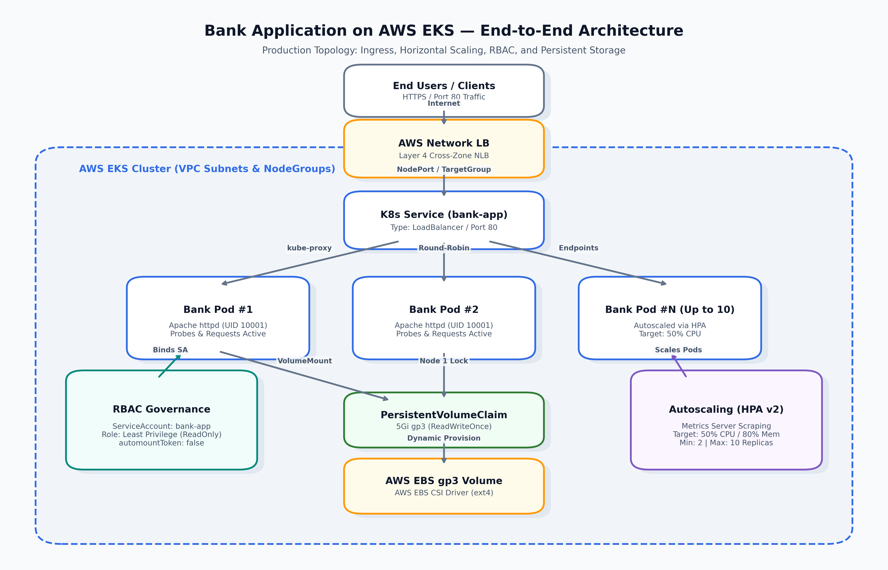
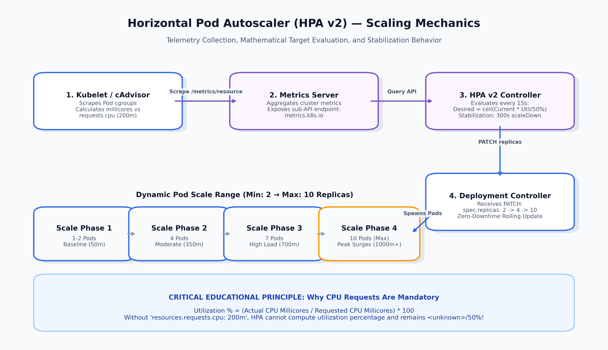
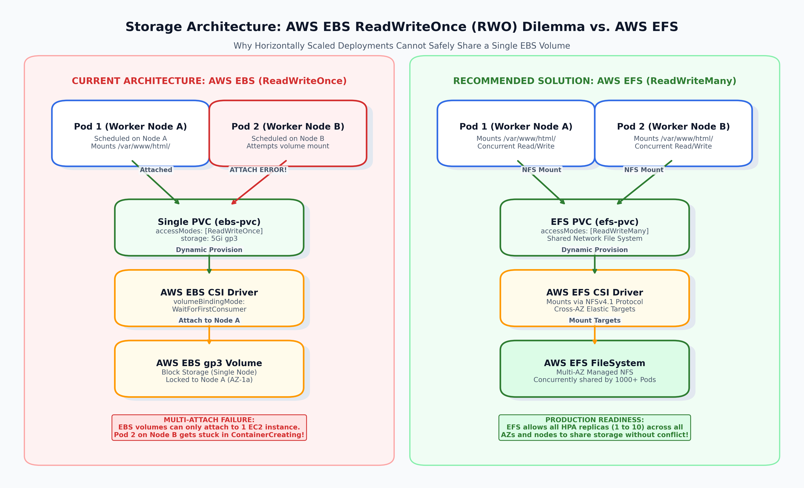
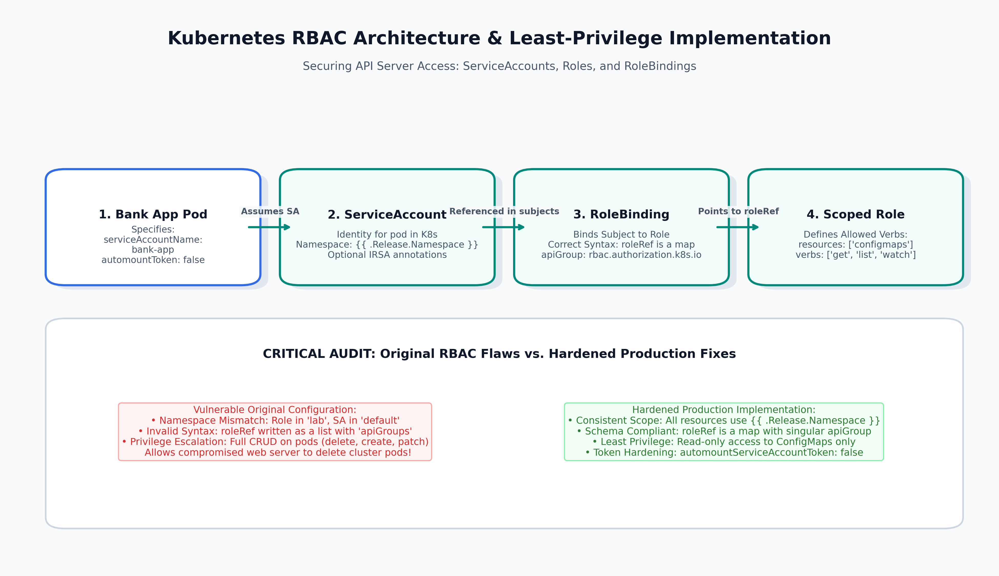

# 🏦 Bank Application on Kubernetes (AWS EKS)

[](https://kubernetes.io/)
[](https://helm.sh/)
[](https://aws.amazon.com/eks/)
[-7E57C2)](docs/scaling.md)
[](docs/security.md)
[](LICENSE)

> **Enterprise DevOps Portfolio & Educational Architecture Showcase**  
> A production-grade, highly available financial web application deployed on **Amazon Elastic Kubernetes Service (AWS EKS)** using **Helm v3**. Features automated elasticity with **Horizontal Pod Autoscaler (HPA v2)**, **Least-Privilege RBAC**, **AWS EBS CSI** dynamic storage provisioning, and zero-downtime rolling deployments.
>
> 👨‍💻 **Author**: Someswara Rao Tarra  
> 🎯 **Target Roles**: Senior DevOps Engineer, Kubernetes Architect, Cloud Platform Engineer, SRE

---

## 📑 Table of Contents

1. [Project Overview](#-1-project-overview)
2. [Business & Technical Problem](#-2-business--technical-problem)
3. [Architecture Diagrams & Data Flow](#-3-architecture-diagrams--data-flow)
4. [Technology Stack](#-4-technology-stack)
5. [Repository Structure](#-5-repository-structure)
6. [Comprehensive Audit: Original Flaws vs. Production Fixes](#-6-comprehensive-audit-original-flaws-vs-production-fixes)
7. [Teaching-Oriented Deep Dives](#-7-teaching-oriented-deep-dives)
   * [7.1 Horizontal Pod Autoscaling (HPA v2) & CPU Math](#71-horizontal-pod-autoscaling-hpa-v2--cpu-math)
   * [7.2 Storage Architecture: AWS EBS (RWO) vs. AWS EFS (RWX)](#72-storage-architecture-aws-ebs-rwo-vs-aws-efs-rwx)
   * [7.3 Zero-Trust RBAC & ServiceAccount Governance](#73-zero-trust-rbac--serviceaccount-governance)
   * [7.4 Health Probes Triad (Startup, Readiness, Liveness)](#74-health-probes-triad-startup-readiness-liveness)
   * [7.5 Compute Resource Management & QoS Classes](#75-compute-resource-management--qos-classes)
   * [7.6 Zero-Downtime Rolling Update & PodDisruptionBudget](#76-zero-downtime-rolling-update--poddisruptionbudget)
8. [Helm Chart Architecture & Parameterization](#-8-helm-chart-architecture--parameterization)
9. [Step-by-Step Deployment Guide](#-9-step-by-step-deployment-guide)
10. [Upgrade & Zero-Downtime Rollback Guide](#-10-upgrade--zero-downtime-rollback-guide)
11. [Troubleshooting Playbook & Incident Runbook](#-11-troubleshooting-playbook--incident-runbook)
12. [Production-Readiness Checklist](#-12-production-readiness-checklist)
13. [Known Limitations & Architectural Trade-Offs](#-13-known-limitations--architectural-trade-offs)
14. [Future DevOps CI/CD & GitOps Roadmap](#-14-future-devops-cicd--gitops-roadmap)
15. [Technical Presentation & Slide Deck](#-15-technical-presentation--slide-deck)
16. [Interview Preparation Guide](#-16-interview-preparation-guide)

---

## 🏛 1. Project Overview

The **Bank Application** represents an enterprise banking frontend interface built with Apache HTTP Server (`httpd`) and containerized to execute securely on AWS EKS. In modern financial engineering, banking systems must maintain continuous 99.99% availability, scale dynamically during high-volume trading hours or payroll surges, withstand underlying node failures, and strictly isolate workloads according to compliance frameworks (e.g., PCI-DSS, SOC 2 Type II).

This repository demonstrates how to take a baseline, error-prone Kubernetes deployment and transform it into a **resilient, hardened, production-grade cloud platform artifact**.

---

## 💼 2. Business & Technical Problem

### The Business Challenge
* **Transaction Surges**: Banking applications experience extreme traffic peaks (market open, month-end payroll). Static sizing either causes system crashes during spikes or wastes millions of dollars in idle cloud compute during off-hours.
* **Strict Zero-Downtime Requirements**: Any maintenance outage breaks customer trust, halts payments, and incurs regulatory non-compliance penalties.
* **Security & Regulatory Compliance**: Banking regulations prohibit running containers as root or exposing unnecessary Kubernetes API privileges.

### The Technical Challenge
* **Legacy Configuration Flaws**: Early manifests contained conflicting namespaces (`default` vs `lab`), broken RBAC `roleRef` schema syntax, and overly permissive pod deletion rights.
* **Storage-Scaling Collision**: Deployments scaling horizontally via HPA were configured with a single AWS EBS PersistentVolumeClaim (`ReadWriteOnce`). When pods scheduled onto separate EC2 nodes, EBS attachments failed with `Multi-Attach error`.
* **Telemetry Deadlocks**: Autoscaling was stalled because CPU requests were undefined, preventing HPA from calculating utilization metrics.

---

## 📐 3. Architecture Diagrams & Data Flow

### 3.1 End-to-End System Architecture

```text
[ Clients / Mobile / Web Users ]
               │
               ▼ (HTTPS / HTTP:80)
┌─────────────────────────────────────────┐
│     AWS Network Load Balancer (NLB)     │ ◄── Cross-Zone Load Balancing
└────────────────────┬────────────────────┘
                     │ (NodePort / Instance Targets)
                     ▼
┌─────────────────────────────────────────┐
│     Kubernetes Service (bank-app)       │ ◄── Type: LoadBalancer (Port 80)
└────────────────────┬────────────────────┘
                     │ (Round-Robin Endpoint Routing via kube-proxy)
        ┌────────────┴────────────┐
        ▼                         ▼
┌───────────────┐         ┌───────────────┐
│  Bank Pod #1  │         │  Bank Pod #2  │ ◄── Replicas Scale Dynamically (2 to 10)
└───────┬───────┘         └───────┬───────┘
        │                         │
        │ [Probes & Non-Root]     │ [Probes & Non-Root]
        ▼                         ▼
┌─────────────────────────────────────────┐
│       AWS EBS CSI Driver Plugin         │ ◄── Dynamic gp3 Provisioning
└────────────────────┬────────────────────┘
                     │
                     ▼
┌─────────────────────────────────────────┐
│   PersistentVolumeClaim (5Gi gp3 ext4)  │ ◄── Bound via WaitForFirstConsumer
└─────────────────────────────────────────┘
```



---

### 3.2 Horizontal Pod Autoscaler (HPA v2) Telemetry Flow

```text
┌─────────────────┐       Scrapes /metrics/resource       ┌──────────────────┐
│  Kubelet Agent  │ ────────────────────────────────────► │  Metrics Server  │
└─────────────────┘                                       └────────┬─────────┘
                                                                   │ Exposes metrics.k8s.io
                                                                   ▼
┌─────────────────┐       Scales Replicas (2 to 10)       ┌──────────────────┐
│   Deployment    │ ◄──────────────────────────────────── │  HPA Controller  │
└────────┬────────┘                                       └──────────────────┘
         │
         ▼
┌─────────────────────────────────────────────────────────┐
│ Pod Count: 2 Pods (Baseline) ──► 5 Pods ──► 10 Pods     │
└─────────────────────────────────────────────────────────┘
```



---

### 3.3 Storage Architecture: AWS EBS (RWO) vs. AWS EFS (RWX)

```text
CURRENT LIMITATION (AWS EBS):
[Node Alpha: Pod 1] ─── Attached ───► [EBS gp3 Volume (RWO)] ◄─── ATTACH ERROR! ─── [Node Beta: Pod 2]

PRODUCTION ARCHITECTURE (AWS EFS):
[Node Alpha: Pod 1] ─── NFS Mount ──► [AWS EFS FileSystem] ◄─── NFS Mount ─── [Node Beta: Pod 2]
                                      (ReadWriteMany / Shared)
```



---

### 3.4 Zero-Trust RBAC Flow

```text
┌───────────────┐
│ Bank App Pod  │ (Runs as UID 10001, automountServiceAccountToken: false)
└───────┬───────┘
        │ Assumes Identity
        ▼
┌─────────────────────────────────┐
│   ServiceAccount: bank-app      │ (Scoped to {{ .Release.Namespace }})
└───────────────┬─────────────────┘
                │ Bound via
                ▼
┌─────────────────────────────────┐
│ RoleBinding: bank-app-rb        │ (apiGroup: rbac.authorization.k8s.io)
└───────────────┬─────────────────┘
                │ Points to
                ▼
┌─────────────────────────────────┐
│ Role: bank-app-role             │ (Least Privilege: get/list on ConfigMaps only)
└─────────────────────────────────┘
```



---

## 🛠 4. Technology Stack

| Layer | Technology | Version / Spec | Purpose in Bank Application |
| :--- | :--- | :--- | :--- |
| **Cloud Provider** | Amazon Web Services (AWS) | EKS v1.28+ | Managed enterprise Kubernetes control plane |
| **Orchestration** | Kubernetes | apps/v1, v1 | Core container orchestration and reconciliation |
| **Package Manager**| Helm | v3.12+ | Templating, environment parameterization, release management |
| **Autoscaling** | HPA | autoscaling/v2 | CPU (50%) & Memory (80%) dynamic horizontal autoscaling |
| **Load Balancing** | AWS Network Load Balancer | AWS LBC v2.6+ | Ultra-low latency Layer 4 public ingress |
| **Storage Subsystem**| AWS EBS CSI Driver | gp3 / ext4 | Dynamic persistent volume provisioning |
| **Container Image**| Apache HTTP Server | `someshtarra/httpd:fox-3D` | Banking frontend application web server |
| **Security Standard**| Pod Security Standards | Restricted Profile | Non-root execution, privilege escalation disabled, capabilities dropped |

---

## 📂 5. Repository Structure

```text
bank-app/
├── Chart.yaml                          # Helm v2 metadata (version 1.0.0, appVersion 2.4.58)
├── values.yaml                         # Self-documenting production configuration values
├── README.md                           # Master DevOps portfolio & architectural documentation
├── INTERVIEW.md                        # 25+ Junior-to-Architect interview questions & answers
├── .gitignore                          # Standard git exclusions for Helm, Python, OS artifacts
├── templates/                          # Declarative Kubernetes manifest templates
│   ├── _helpers.tpl                    # Standard Helm template functions & label generators
│   ├── deployment.yaml                 # Hardened deployment (probes, securityContext, QoS, affinity)
│   ├── service.yaml                    # LoadBalancer service with AWS NLB annotations
│   ├── hpa.yaml                        # autoscaling/v2 HPA with dual metrics & stabilization
│   ├── serviceaccount.yaml             # Dedicated ServiceAccount with token automount control
│   ├── role.yaml                       # Least-privilege Role (scoped to configmaps)
│   ├── rolebinding.yaml                # Syntactically compliant RoleBinding
│   ├── pvc.yaml                        # PersistentVolumeClaim for gp3 storage
│   ├── storageclass.yaml               # StorageClass with WaitForFirstConsumer & Retain
│   ├── pdb.yaml                        # PodDisruptionBudget for high availability
│   └── NOTES.txt                       # Post-installation verification output
├── docs/                               # Enterprise deep-dive guides
│   ├── architecture.md                 # System architecture, ingress, and data flow
│   ├── deployment-guide.md             # AWS EKS step-by-step installation, upgrade, rollback
│   ├── troubleshooting.md              # Real-world incident runbooks (Multi-Attach, OOM, HPA)
│   ├── security.md                     # CIS Kubernetes Benchmark & Pod Security Standards
│   └── scaling.md                      # HPA math, Metrics Server, and performance testing
├── diagrams/                           # High-resolution (300 DPI) and vector visual assets
│   ├── architecture.png (.svg)         # End-to-end cloud architecture diagram
│   ├── hpa-flow.png (.svg)             # Autoscaling & telemetry flow
│   ├── storage-flow.png (.svg)         # Storage RWO multi-node conflict & EFS solution
│   └── rbac-flow.png (.svg)            # RBAC least-privilege identity binding flow
└── presentation/                       # Executive slide deck
    ├── devops-kubernetes-project.pptx  # 21-slide executive PowerPoint presentation
    └── slides.md                       # Full slide deck transcript and speaker notes
```

---

## 🔍 6. Comprehensive Audit: Original Flaws vs. Production Fixes

| Subsystem | Original Legacy Configuration | Architectural Flaw / Impact | Production-Grade Implementation |
| :--- | :--- | :--- | :--- |
| **Namespace Consistency** | `service.yaml` in `default`; `role.yaml` and `role-binding.yaml` in `lab`; Deployment has none. | Components deployed to disjoint namespaces. Service cannot find pods; RoleBinding fails to bind ServiceAccount. | Hardcoded namespaces eliminated. Standardized on `{{ .Release.Namespace }}` across all resources. |
| **RBAC Schema** | `roleRef` formatted as a YAML list with `apiGroups` (plural). | **Invalid Schema**: Kubernetes OpenAPI validation fails. Cannot apply manifest to modern clusters. | Formatted as a single map with singular `apiGroup: rbac.authorization.k8s.io`. |
| **RBAC Permissions** | Full CRUD (`delete`, `create`, `patch`, `watch`, `get`, `list`) on `pods`. | **Critical Security Vulnerability**: If web server is breached, attacker can delete all pods in the cluster. | Principle of Least Privilege: Restricted to read-only (`get`, `list`) on ConfigMaps. |
| **ServiceAccount Token** | Default token automount enabled on all pods. | Exposes API credentials at `/var/run/secrets/...` to containers that never interact with Kubernetes API. | Explicitly set `automountServiceAccountToken: false` on ServiceAccount and Deployment. |
| **Autoscaling API** | Legacy `apiVersion: autoscaling/v1` with single metric. | Deprecated in K8s 1.25+; lacks multi-metric scaling, memory scaling, and stabilization controls. | Upgraded to **`autoscaling/v2`** with dual CPU & Memory metrics and 300s scale-down stabilization. |
| **CPU Requests for HPA** | Relationship between CPU requests and HPA undocumented. | If CPU requests are missing, HPA fails with `<unknown> / 50%` because utilization ratio has no denominator. | Documented mathematical formula; enforced `resources.requests.cpu: 200m` in deployment. |
| **Storage Architecture** | Deployment with multiple replicas (`2` to `10`) mounting one EBS PVC (`ReadWriteOnce`). | **Multi-Attach Error**: EBS attaches to only 1 node. Replicas on other nodes get stuck in `ContainerCreating`. | Documented RWO limitation; configured `WaitForFirstConsumer`; provided AWS EFS (RWX) migration path. |
| **Container Hardening** | Runs as root (`UID 0`), default capabilities retained, privilege escalation enabled. | High risk of container escape and node compromise (violates CIS Benchmark and PSS Restricted). | Pod runs as non-root `UID 10001`, `drop: ["ALL"]` capabilities, `allowPrivilegeEscalation: false`. |
| **Health Probes** | Probes configured without explaining probe lifecycle rationale. | Misconfigured liveness probes can cause cascading crash loops during backend slowdowns. | Fine-tuned `startupProbe` (100s window), `readinessProbe` (HTTP), and `livenessProbe` (TCP socket). |
| **High Availability** | No PodDisruptionBudget defined. | Node drains during EKS cluster upgrades can evict all replicas simultaneously, causing outages. | Added `PodDisruptionBudget` (`minAvailable: 1`) to guarantee service continuity. |

---

## 🎓 7. Teaching-Oriented Deep Dives

### 7.1 Horizontal Pod Autoscaling (HPA v2) & CPU Math

* **Concept**: Automatic horizontal elasticity adjusting pod replica count based on real-time resource utilization.
* **Why It Exists**: Eliminates manual capacity intervention during traffic surges and cuts cloud compute costs during idle periods.
* **How It Works**:
  The HPA controller queries the `metrics.k8s.io` API served by the **Metrics Server** every 15 seconds. It computes:
  $$\text{Desired Replicas} = \left\lceil \text{Current Replicas} \times \left( \frac{\text{Current Metric Value}}{\text{Target Metric Value}} \right) \right\rceil$$
  $$\text{CPU Utilization \%} = \left( \frac{\text{Actual Usage in Millicores}}{\text{Requested CPU in Millicores}} \right) \times 100$$
* **How It Is Configured**:
  ```yaml
  apiVersion: autoscaling/v2
  kind: HorizontalPodAutoscaler
  metadata:
    name: bank-app
  spec:
    scaleTargetRef:
      apiVersion: apps/v1
      kind: Deployment
      name: bank-app
    minReplicas: 2
    maxReplicas: 10
    metrics:
      - type: Resource
        resource:
          name: cpu
          target:
            type: Utilization
            averageUtilization: 50
    behavior:
      scaleDown:
        stabilizationWindowSeconds: 300
  ```
* **Common Mistakes**:
  1. Omitting `resources.requests.cpu`: The HPA displays `<unknown> / 50%` and scaling is permanently disabled.
  2. Setting stabilization windows too short, leading to rapid scale-up/scale-down flapping (thrashing).
* **Production Recommendation**:
  Always use `autoscaling/v2`. Couple CPU scaling with Memory scaling and a 300-second scale-down stabilization window. Pair with AWS Karpenter for automated node provisioning.

---

### 7.2 Storage Architecture: AWS EBS (RWO) vs. AWS EFS (RWX)

* **Concept**: Block storage (AWS EBS) vs. Network File Storage (AWS EFS) in containerized multi-replica deployments.
* **Why It Exists**: State and file persistence across pod restarts.
* **How It Works**:
  * **AWS EBS**: Virtual raw block device. An EBS volume attaches to a single EC2 instance hypervisor via AWS NVMe. In Kubernetes, this is declared as `accessModes: [ ReadWriteOnce ]`.
  * **AWS EFS**: Managed NFSv4.1 network file system. Mountable concurrently over the VPC by thousands of EC2 instances and pods simultaneously (`ReadWriteMany`).
* **The Multi-Attach Conflict Explained**:
  When the Bank Application deployment scales from 2 to 10 pods:
  1. Pod 1 lands on Node A in `us-east-1a` $\rightarrow$ EBS volume attaches successfully.
  2. Pod 2 lands on Node B in `us-east-1b` $\rightarrow$ AWS rejects attachment:
     ```text
     Multi-Attach error for volume "pvc-xxxx": Volume is already exclusively attached to one node and can't be attached to another
     ```
  3. Pod 2 is stuck in `ContainerCreating` indefinitely.
* **Production Recommendation**:
  For horizontally scaled web frontends sharing files, migrate from EBS to **AWS EFS (RWX)** or store static assets in **AWS S3**. Reserve EBS for single-replica stateful databases or StatefulSets with dedicated disks.

---

### 7.3 Zero-Trust RBAC & ServiceAccount Governance

* **Concept**: Controlling identity and permissions within the Kubernetes API Server.
* **Why It Exists**: Adheres to the Principle of Least Privilege; minimizes blast radius in the event of container compromise.
* **How It Works**:
  A **ServiceAccount** provides pod identity $\rightarrow$ A **Role** defines allowed verbs on specific API resources $\rightarrow$ A **RoleBinding** associates the ServiceAccount with the Role.
* **Original Mistake**:
  ```yaml
  # VULNERABLE LEGACY ROLE (DO NOT USE)
  rules:
  - apiGroups: [""]
    resources: ["pods"]
    verbs: ["delete", "create", "patch"]
  ```
* **Production Fix**:
  1. Set `automountServiceAccountToken: false` on ServiceAccount. Web pods do not need Kubernetes API tokens.
  2. If configuration discovery is required, grant read-only (`get`, `list`) access to ConfigMaps only.
  3. Fix `roleRef` syntax from invalid list to map:
     ```yaml
     roleRef:
       apiGroup: rbac.authorization.k8s.io
       kind: Role
       name: bank-app-role
     ```

---

### 7.4 Health Probes Triad (Startup, Readiness, Liveness)

* **Concept**: Automated container lifecycle supervision and traffic isolation.
* **The Three Probes Compared**:

| Probe Type | Primary Responsibility | Failure Action | Key Timing Consideration |
| :--- | :--- | :--- | :--- |
| **Startup Probe** | "Is initialization finished?" | Kills and restarts container if timeout exceeded. | Protects slow initialization (allows up to 100s). Disables liveness probe while active. |
| **Readiness Probe**| "Can the pod accept traffic right now?" | Removes pod IP from Service endpoints. Pod remains running! | Prevents users from hitting cold or overloaded pods. |
| **Liveness Probe** | "Is the process deadlocked?" | Kubelet kills and restarts the container. | Uses lightweight TCP socket check to prevent cascading restarts during downstream outages. |

---

### 7.5 Compute Resource Management & QoS Classes

* **Concept**: Linux cgroup boundaries controlling CPU and Memory allocation.
* **Requests vs. Limits**:
  * **Requests (200m CPU / 128Mi RAM)**: Guaranteed baseline reserved on the node. Determines Quality of Service (QoS) class (**Burstable**).
  * **Limits (500m CPU / 256Mi RAM)**: Hard ceiling.
* **What Happens When Limits Are Exceeded**:
  * **CPU Limit Exceeded**: The Linux CFS (Completely Fair Scheduler) throttles the container's CPU shares. Latency increases, but **the process is not killed**.
  * **Memory Limit Exceeded**: The Linux kernel OOM (Out Of Memory) Killer immediately terminates the container with **Exit Code 137** (`OOMKilled`).

---

### 7.6 Zero-Downtime Rolling Update & PodDisruptionBudget

* **RollingUpdate Strategy**:
  ```yaml
  strategy:
    type: RollingUpdate
    rollingUpdate:
      maxSurge: 1
      maxUnavailable: 0
  ```
  * `maxUnavailable: 0` ensures 100% capacity remains active throughout the deployment.
  * An old pod is only terminated after a newly created pod passes both its `startupProbe` and `readinessProbe`.
* **PodDisruptionBudget (PDB)**:
  Guarantees that voluntary disruptions (node drains, cluster upgrades) never terminate all replicas at once, enforcing `minAvailable: 1`.

---

## 📦 8. Helm Chart Architecture & Parameterization

The chart is designed to be fully configurable across environments without duplicating YAML manifests:

```bash
# Key parameter overrides available in values.yaml
replicaCount: 2
image.repository: someshtarra/httpd
image.tag: fox-3D
service.type: LoadBalancer
autoscaling.enabled: true
autoscaling.minReplicas: 2
autoscaling.maxReplicas: 10
storage.enabled: true
storage.type: ebs
```

---

## 🚀 9. Step-by-Step Deployment Guide

### 9.1 Prerequisites
```bash
# Ensure AWS CLI, kubectl, and Helm are installed
aws sts get-caller-identity
kubectl version --client
helm version
```

### 9.2 Pre-Flight Validation
```bash
# 1. Lint the Helm chart
helm lint .

# 2. Render templates locally to verify output
helm template bank-app . --namespace production > /tmp/bank-app-rendered.yaml

# 3. Perform a Kubernetes dry-run validation
kubectl apply --dry-run=server -f /tmp/bank-app-rendered.yaml -n production
```

### 9.3 Installation
```bash
helm upgrade --install bank-app . \
  --namespace production \
  --create-namespace \
  --values values.yaml \
  --wait \
  --timeout 10m
```

### 9.4 Verification
```bash
# Verify pods, services, HPA, and storage in production namespace
kubectl get all,pvc,hpa,pdb -n production

# Obtain the AWS Network Load Balancer URL
export SERVICE_URL=$(kubectl get svc bank-app -n production -o jsonpath='{.status.loadBalancer.ingress[0].hostname}')
echo "Bank Application accessible at: http://$SERVICE_URL"
```

---

## 🔄 10. Upgrade & Zero-Downtime Rollback Guide

### Triggering a Rolling Upgrade
```bash
# Upgrade image tag to a new release
helm upgrade bank-app . \
  --namespace production \
  --set image.tag="v2.0.0" \
  --wait

# Monitor rollout progression in real time
kubectl rollout status deployment/bank-app -n production
```

### Instant Rollback
```bash
# 1. Inspect release revision history
helm history bank-app -n production

# 2. Instantly rollback to Revision 1
helm rollback bank-app 1 -n production

# 3. Confirm rollback health
kubectl rollout status deployment/bank-app -n production
```

---

## 🛠 11. Troubleshooting Playbook & Incident Runbook

Detailed diagnostic steps and recovery procedures are documented in [`docs/troubleshooting.md`](docs/troubleshooting.md):

* **`Multi-Attach error for volume`**: Diagnose EBS single-node attachment conflict; remediate with pod affinity or migrate to AWS EFS.
* **`HPA showing <unknown> / 50%`**: Verify Metrics Server connectivity and ensure `resources.requests.cpu` is explicitly declared.
* **`OOMKilled (Exit Code 137)`**: Inspect historical memory usage via `kubectl top pod` and increase `resources.limits.memory`.
* **`Service Endpoints <none>`**: Resolve selector label mismatches and inspect failing readiness probe endpoints.

---

## ✅ 12. Production-Readiness Checklist

* [x] **Namespace Scoping**: All manifests dynamically scoped to `{{ .Release.Namespace }}`.
* [x] **Schema Validation**: 100% compliant with Kubernetes OpenAPI v3 specs (`roleRef` map format).
* [x] **Least-Privilege RBAC**: Pod deletion permissions removed; token automount disabled.
* [x] **Modern Autoscaling**: Migrated to `autoscaling/v2` with CPU & Memory metrics and stabilization.
* [x] **Explicit QoS**: Mandatory CPU/memory requests and limits defined for all containers.
* [x] **Storage Resiliency**: `WaitForFirstConsumer` AZ scheduling lock configured; EBS limitations documented.
* [x] **High Availability**: Rolling update strategy (`maxUnavailable: 0`) and `PodDisruptionBudget` deployed.
* [x] **Container Hardening**: Non-root UID 10001, capabilities dropped, privilege escalation disabled.

---

## ⚠️ 13. Known Limitations & Architectural Trade-Offs

1. **AWS EBS ReadWriteOnce Limitation**:
   * *Trade-Off*: EBS gp3 delivers predictable, cost-effective block performance. However, because it is RWO, scaling pods across multiple EC2 nodes will fail.
   * *Resolution*: Documented migration to AWS EFS (RWX) or stateless architecture with S3.
2. **Layer 4 vs. Layer 7 Ingress**:
   * *Trade-Off*: The chart currently uses a Layer 4 Network Load Balancer via `type: LoadBalancer`. While low-latency, it does not provide path-based routing or WAF integration out of the box.
   * *Roadmap*: Transition to AWS ALB Ingress Controller with TLS termination.

---

## 🗺 14. Future DevOps CI/CD & GitOps Roadmap

```text
GitHub Commit (main)
        │
        ▼
┌───────────────────────────────┐
│     GitHub Actions CI         │ ◄── Lint, Unit Test, Trivy Vulnerability Scan
└───────────────┬───────────────┘
                │ Builds & Signs Image
                ▼
┌───────────────────────────────┐
│   Amazon Elastic Container    │ ◄── Immutable Digest Pinning (sha256)
│       Registry (ECR)          │
└───────────────┬───────────────┘
                │ Triggers GitOps Sync
                ▼
┌───────────────────────────────┐
│           Argo CD             │ ◄── Declarative Helm Sync & Drift Detection
└───────────────┬───────────────┘
                │ Reconciles
                ▼
┌───────────────────────────────┐
│       AWS EKS Cluster         │ ◄── Instrumented with Prometheus & Grafana
└───────────────────────────────┘
```

* **GitOps Continuous Delivery**: Implement **Argo CD** for automated declarative syncing and self-healing.
* **Security Automation**: Integrate **Trivy** in GitHub Actions for image scanning and **External Secrets Operator** for AWS Secrets Manager sync.
* **Advanced Autoscaling**: Deploy **AWS Karpenter** to replace legacy Cluster Autoscaler for 40-second node provisioning.
* **Full-Stack Observability**: Instrument with **Prometheus Operator**, **Grafana**, and **Loki** for real-time RED metrics and log aggregation.

---

## 📊 15. Technical Presentation & Slide Deck

A 21-slide executive presentation deck is included in this repository:

* 📥 **PowerPoint File**: [`presentation/devops-kubernetes-project.pptx`](presentation/devops-kubernetes-project.pptx)
* 📖 **Slide Outline & Speaker Notes**: [`presentation/slides.md`](presentation/slides.md)

---

## 🎯 16. Interview Preparation Guide

Preparing for a DevOps or Kubernetes interview? Review [`INTERVIEW.md`](INTERVIEW.md) for 25+ detailed questions and answers based directly on this project, covering:
* *Why Helm? Why Kubernetes? Why EKS?*
* *How HPA calculates desired replicas and why CPU requests are mandatory*
* *The mechanics of AWS EBS Multi-Attach errors and EFS RWX resolution*
* *Kubernetes RBAC least-privilege principles and container security hardening*
* *The health probe triad and zero-downtime rolling update mechanics*

---

## 📄 License & Attribution

This project is licensed under the Apache 2.0 License. Developed by **Someswara Rao Tarra** as an educational DevOps and Cloud Architecture portfolio showcase.
